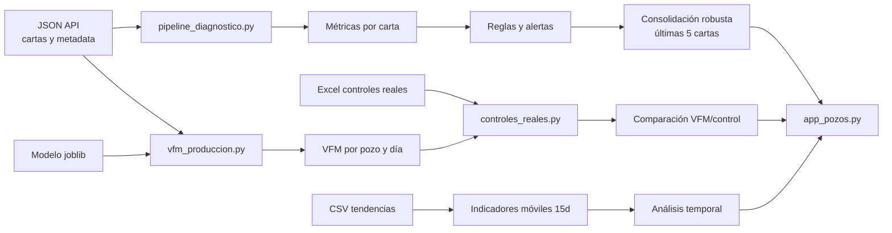

# Arquitectura

## Flujo general



## Responsabilidades por módulo

### `pipeline_diagnostico.py`

Es la fuente técnica principal. Contiene:

- carga y normalización del JSON;
- validación de 80 puntos por colección;
- separación de carreras;
- detección de horizontales;
- construcción de carta ideal;
- áreas por cuadrante;
- métricas de transferencia, ángulos y golpes;
- validación de integridad geométrica;
- reglas diagnósticas por carta;
- indicadores móviles de 15 días;
- análisis temporal de subexplotación, falta de aporte y bloqueo.

La interfaz pública principal es:

```python
salida = procesar_json(origen, silencioso=True)
```

La salida incluye, entre otras tablas:

- `muestra`;
- `resultados_cartas`;
- `base_diagnosticos`;
- `metricas_cartas`;
- `diagnosticos_cartas`;
- `errores_cartas`.

### `app_pozos.py`

Orquesta la experiencia Streamlit:

- carga de varios JSON;
- deduplicación por `CartaId`;
- ejecución cacheada del pipeline;
- filtros robustos por pozo y filtros individuales por carta;
- resumen, explorador, detalle y descargas;
- consolidación de las últimas cinco cartas;
- gráficos de tendencias;
- integración VFM y controles.

La aplicación no debería contener nuevas reglas técnicas de interpretación.
Las reglas, umbrales y análisis temporal deben agregarse primero al pipeline y
la aplicación solamente debe mostrarlos.

### `vfm_produccion.py`

- normaliza las variables requeridas por el modelo;
- agrupa por pozo y día;
- usa medianas de las cartas disponibles;
- carga `modelos_finales.joblib.gz`;
- predice caudal bruto, petróleo y corte de agua.

El VFM queda anulado para cartas que el pipeline marca como inválidas.

### `controles_reales.py`

- lee el Excel de controles;
- normaliza nombres de pozo;
- selecciona para cada predicción el último control no posterior;
- calcula deltas y errores;
- redacta comentarios automáticos.

## Consolidación robusta

Para cada pozo:

1. ordenar cartas por fecha descendente;
2. tomar las últimas cinco;
3. contar cada diagnóstico principal o secundario una vez por carta;
4. considerar robusto el diagnóstico con al menos tres apariciones.

Puede haber varios diagnósticos robustos simultáneos. “Pozo bien explotado”
participa como un diagnóstico más y también requiere tres de cinco.

## Caching y reprocesamiento

`ejecutar_pipeline` está cacheado por Streamlit. La clave incluye:

- bytes del JSON;
- texto de `PIPELINE_CACHE_VERSION`.

Cuando cambia la lógica:

1. cambiar la versión;
2. redeployar;
3. reprocesar los JSON.

Sin el cambio de versión, Streamlit puede mostrar resultados calculados con una
regla anterior aunque el archivo fuente ya haya cambiado.

## Separación recomendada

| Capa | Responsabilidad |
|---|---|
| Datos | API, JSON, CSV y Excel |
| Cálculo | geometría, métricas, tendencias |
| Reglas | diagnósticos y prioridades |
| Modelos | inferencia VFM |
| Presentación | Streamlit, gráficos y exportaciones |

Esta separación debe conservarse para evitar divergencias entre Colab,
pipeline y tablero.

